# ACME Investment Banking Working Build

A local Streamlit working build for executive meeting preparation, grounded CRM analysis, competitive intelligence workflows, and simulated observability validation.

## Overview

This repository demonstrates a deterministic working build aligned with enterprise coverage workflows.

The solution combines:

- Executive meeting briefing generation
- CRM retrieval and grounding
- Knowledge-source tracing and citations
- Competitive intelligence analysis
- Zero-Trust prompt governance
- Fallback handling for missing data
- Supervisor routing validation
- Simulated observability KPI contracts

## Executive Summary

The ACME working build demonstrates:

- Grounded executive briefing generation from local CRM fixtures and approved knowledge sources
- Account and contact scoping before downstream analysis
- Competitive intelligence, peer benchmarking, strategic insights, and meeting-preparation workflows
- Citation, source-tracing, and no-evidence fallback behavior
- Prompt, observability, regression, and JUnit-based validation evidence

## Architecture at a Glance

| Diagram | Purpose |
|---|---|
| [Solution Flow](docs/architecture/solution-flow.png) | Executive path from user interaction to evidence package |
| [High-Level Architecture](docs/architecture/high-level-architecture.png) | Functional flow across agents, CRM, knowledge grounding, and assurance |
| [Detailed Architecture & Salesforce Target Mapping](docs/architecture/detailed-architecture-salesforce-mapping.png) | Engineering Demo runtime detail and Agentforce working Build |

<p align="center">
  
</p>

For the complete architecture package, see [docs/architecture/README.md](docs/architecture/README.md).

## Agentforce Dev Working Build

> **Scope:** These screenshots document the target-state Agentforce sandbox configuration and validation evidence collected on 14 August 2026. They complement the local Streamlit working build and demonstrate alignment between deterministic engineering contracts and the Salesforce platform target.

### Prompt Builder and Grounding

The configured Prompt Builder templates and preview demonstrate the prompt layer used for executive briefing and competitive-intelligence workflows.

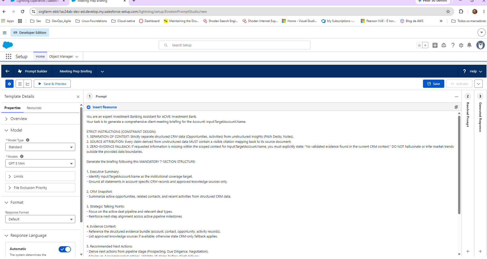

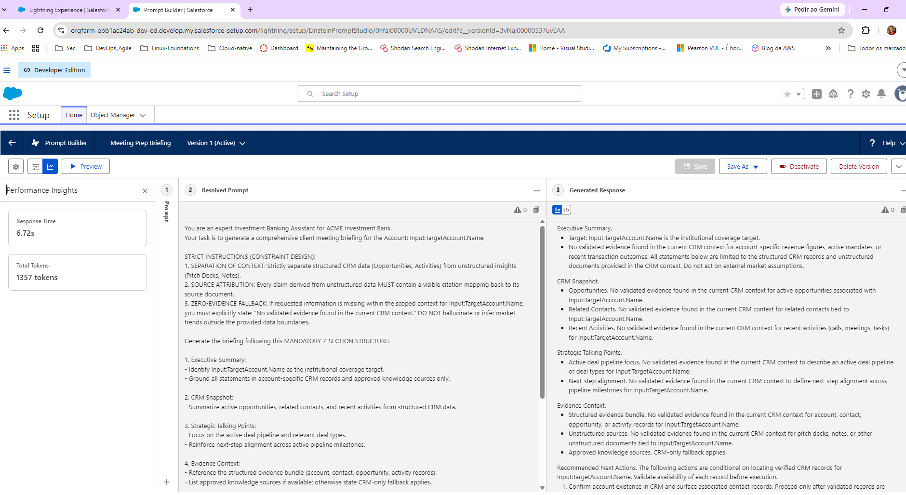

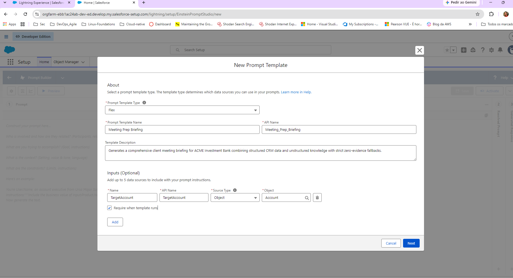

### CRM Data Model and Account Context

The target CRM evidence covers the account, contact, and opportunity context used by the grounding layer.


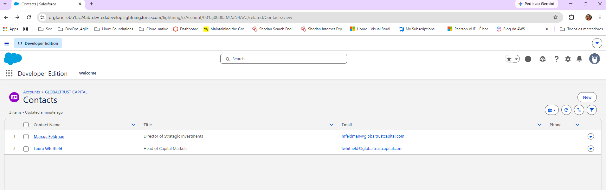

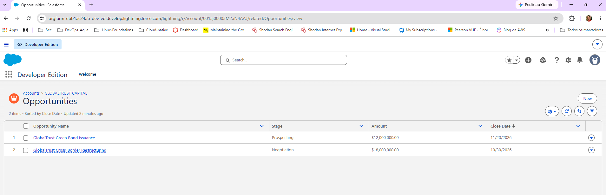

### Account Seeding and Peer Context

The sandbox account evidence verifies account creation, account-list visibility, and peer-account context.

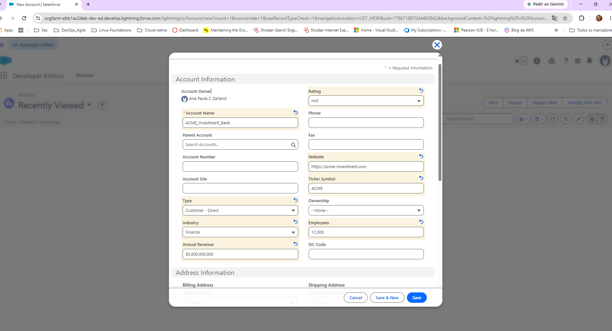

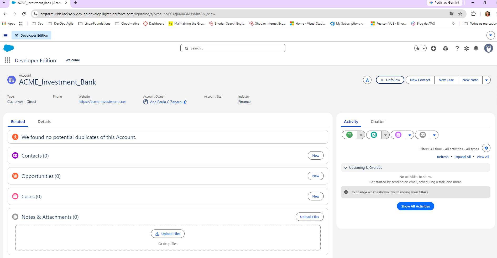

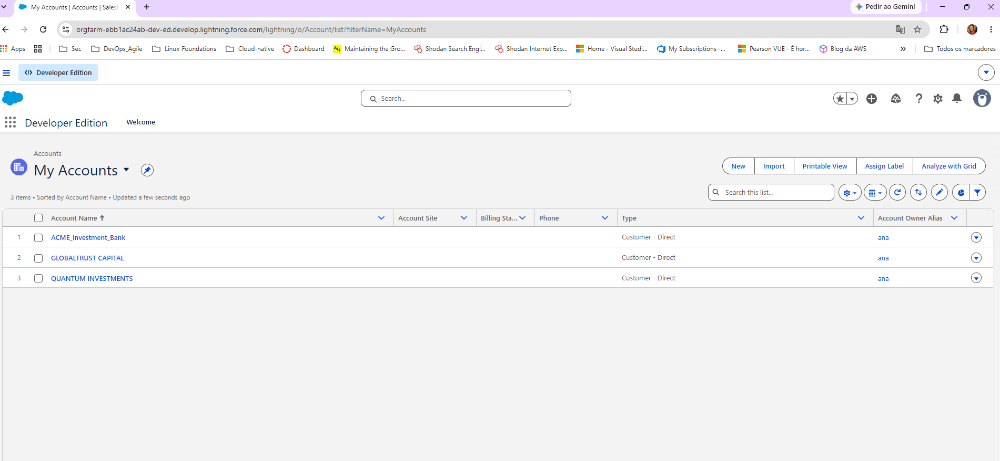

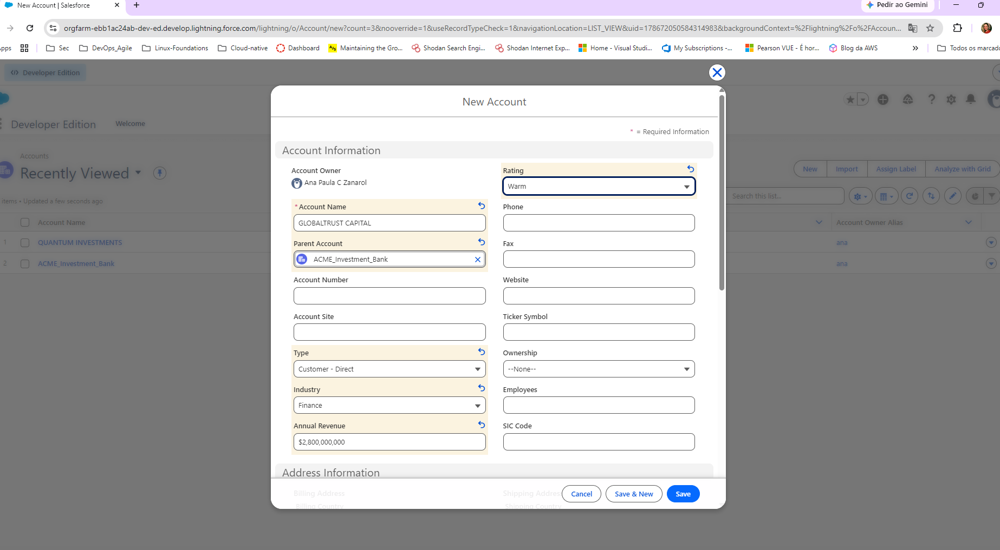

### Agentforce Routing

The routing configuration captures how requests are dispatched through the Agentforce target build.

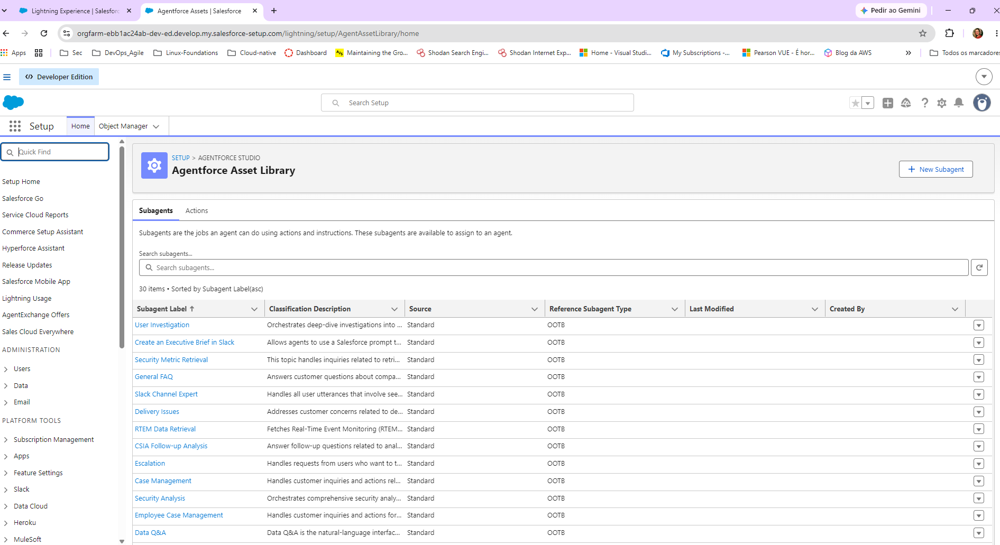

### Validation Evidence

The screenshots below record the validation runs added on 14 August 2026 for observability, contract checks, full regression, and architecture-blueprint evidence.


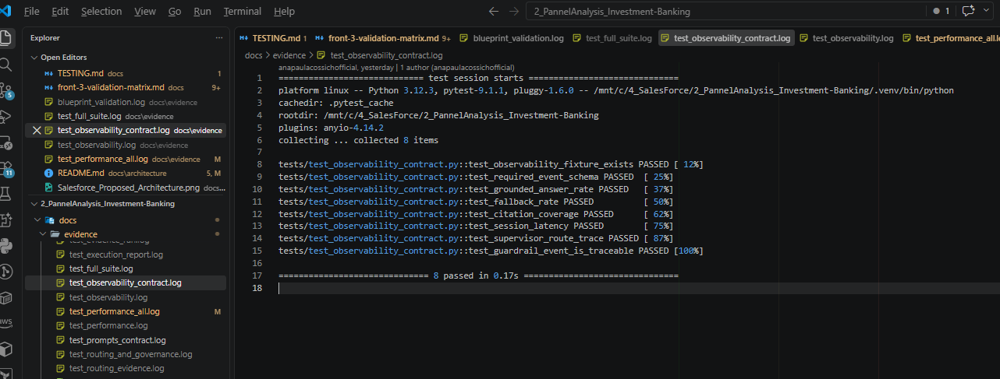

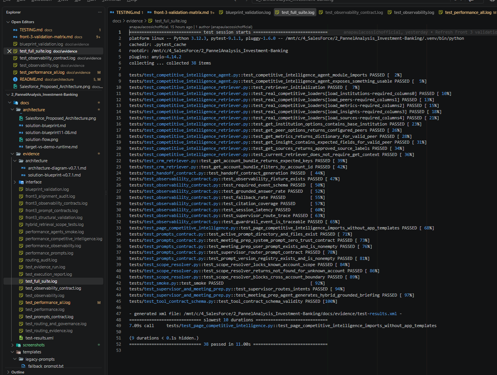


For the complete screenshot catalog, see [docs/evidence/interface/screenshot-index.md](docs/evidence/interface/screenshot-index.md).

## Enterprise Visual Preview

The application provides an executive banking interface for institutional coverage workflows, grounded meeting preparation, and competitive intelligence analysis.

### Main Intelligence Hub


### Executive Briefing


### Competitive Intelligence


### Citations and Source Tracing


### Fallback Validation


### Hallucination Rejection


## Validation Status

The validation package includes:

- Executive briefing UI evidence
- CRM and knowledge grounding evidence
- Citation and source-tracing evidence
- Competitive intelligence routing evidence
- Missing-account and missing-knowledge fallback evidence
- Adversarial prompt rejection evidence
- Prompt governance contract validation
- Observability KPI contract validation
- Full regression and JUnit XML evidence
- **Agentforce target build evidence** — Prompt Builder, CRM data model, account seeding, and routing configuration (`docs/screenshots/1_*.png`)
- **Validation-run evidence** — Observability, contract, full-suite, and blueprint-validation runs (`docs/screenshots/9_*.png`)

Visual evidence is stored under `docs/screenshots/`, and automated evidence is stored under `docs/evidence/`.

## Test Architecture

The repository validates behavior at three complementary levels:

- **Visual validation** through screenshots under `docs/screenshots/`
- **Prompt governance validation** through `tests/test_prompts_contract.py`
- **Observability and regression validation** through `tests/test_observability_contract.py` and the full pytest suite

Generated evidence includes:

```text
docs/evidence/front3_prompt_contracts.log
docs/evidence/front3_observability_contracts.log
docs/evidence/front3_structural_validation.log
docs/evidence/test_full_suite.log
docs/evidence/test-results.xml
docs/evidence/test_performance_all.log
```

## Run the Application

```bash
streamlit run streamlit_app.py
```

## Run the Validation Suite

Validate script syntax:

```bash
bash -n scripts/run_validation_suite.sh
```

Make the script executable:

```bash
chmod +x scripts/run_validation_suite.sh
```

Run the complete validation suite:

```bash
./scripts/run_validation_suite.sh
```

The suite executes:

- Prompt contract tests
- Observability contract tests
- Full regression suite
- JUnit XML generation
- Performance logging

Review the generated evidence:

```bash
ls -lh docs/evidence/
tail -n 20 docs/evidence/test_prompts_contract.log
tail -n 20 docs/evidence/test_observability_contract.log
tail -n 20 docs/evidence/test_full_suite.log
tail -n 20 docs/evidence/test_performance_all.log
```

## Observability Scope

The observability layer is a local simulation aligned with Agentforce Session Tracing concepts.

It validates deterministic KPI behavior for:

- Grounded Answer Rate
- Fallback Rate
- Citation Coverage
- Session latency
- Supervisor route traceability
- Guardrail event traceability

This repository does not claim to expose live Salesforce production telemetry. It demonstrates the local measurement contract and its intended mapping to a future enterprise observability integration.

## Repository References

Primary evidence and validation files:

```text
docs/architecture/README.md
docs/evidence/interface/evidence-note.md
docs/evidence/interface/screenshot-index.md
docs/evidence/interface/validation-log.md
docs/front-1-validation-matrix.md
docs/TESTING.md
scripts/run_validation_suite.sh
```

## Prompt Templates

The single source of truth for prompt templates is the `src/prompts/` directory.

Legacy prompt files are archived under `docs/templates/legacy-prompts/`.
