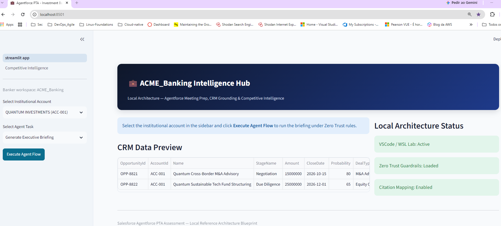
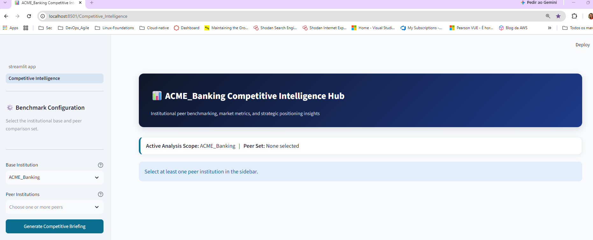
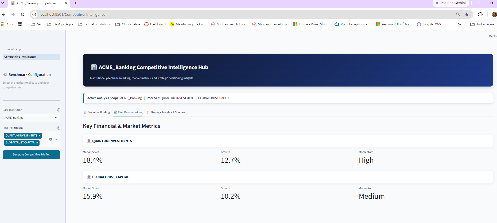

## Executive Summary: ACME Banking Application

- What the ACME working build demonstrates
- How to run the demo
- Which account scenarios to use
- How grounding, citations, and fallback behave
- Link to validation matrix
- Link to architecture
- Link to prompt evolution

## Architecture at a Glance

| Diagram | Purpose |
|---|---|
| [Solution Flow](docs/architecture/solution-flow.png) | Executive path from user interaction to evidence package |
| [High-Level Architecture](docs/architecture/high-level-architecture.png) | Functional flow across agents, CRM, knowledge grounding and assurance |
| [Detailed Architecture & Salesforce Target Mapping](docs/architecture/detailed-architecture-salesforce-mapping.png) | Local implementation detail and target-state Salesforce / Agentforce mapping |

  

## Enterprise Visual Preview
The application includes an executive banking interface designed for
institutional coverage workflows and competitive intelligence analysis.

### Main Intelligence Hub

## Prompt Templates:
The single source of truth for prompt templates is the `src/prompts/` directory.

Legacy prompt files were archived in `docs/templates/legacy-prompts/`.

### Demo Execution Tests:
python -m pytest -q
python -m pytest -v
streamlit run streamlit_app.py