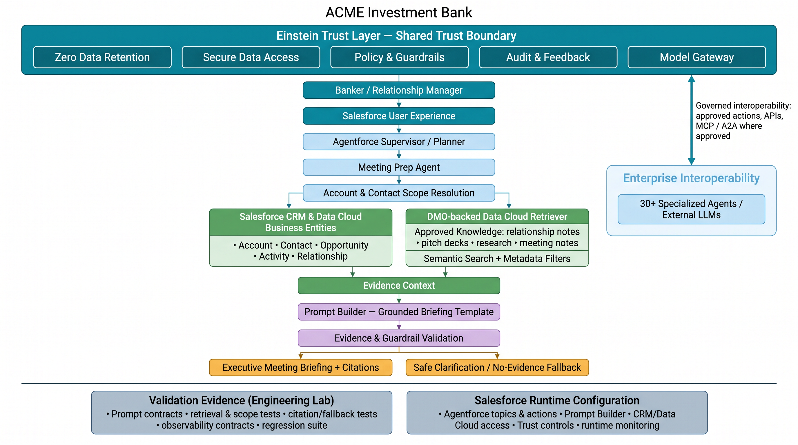

cat <<'EOF' > docs/architecture/README.md
# Architecture Diagrams

This folder contains the presentation-ready architecture diagrams for the ACME Banking Intelligence Hub working build and its Salesforce target-state positioning.

The diagram set is intentionally layered:

- some diagrams describe the **current local working build**;
- some show the **target-state Salesforce alignment**;
- the new functional diagram explains how **Meeting Prep operates step by step**.

## 1. Solution Flow

Shows the executive path from the reviewer interaction through the UI, AI runtime, assurance controls, and evidence package.

## 2. High-Level Architecture

Shows the end-to-end working architecture: banker interaction, supervisor orchestration, specialized agents, CRM and knowledge retrieval, evidence grounding, guardrails, outputs, and validation artifacts.

## 3. Detailed Architecture & Salesforce Target Mapping

Shows the detailed local working build and its target-state mapping to Salesforce and Agentforce capabilities.

This diagram should be presented as an **architecture mapping view**. It explains how the current local implementation aligns to the intended Salesforce business runtime, without overstating that every mapped component is already implemented live in Salesforce.

## 4. Functional Architecture — Meeting Prep

Shows how the Meeting Prep capability operates functionally: banker request, scope validation, parallel evidence retrieval, Evidence Context assembly, grounded prompt execution, guardrail validation, and either grounded briefing output or fallback behavior.

Use this diagram when explaining:
- how Meeting Prep actually runs;
- where scope is enforced;
- where structured and unstructured evidence converge;
- how fallback and observability fit the runtime behavior.

## Visual conventions

| Color | Meaning |
| --- | --- |
| Light blue | User experience, supervisors, orchestration, and specialist agents |
| Green | Retrieval and trusted data sources |
| Purple | Grounding, prompt contracts, and guardrail validation |
| Sand / amber | Business outputs and executive artifacts |
| Gray-blue | Validation, observability, and target-state mapping |

## Presentation guidance

Use the diagrams in this order during the panel:

1. **Solution Flow** — establish the executive narrative
2. **High-Level Architecture** — explain the operating architecture
3. **Functional Architecture — Meeting Prep** — explain runtime behavior in detail
4. **Detailed Architecture & Salesforce Target Mapping** — connect the local working build to the Salesforce target-state design

This sequence helps distinguish:
- what is implemented in the local engineering runtime;
- what is validated as architecture and behavior;
- what is proposed as the Salesforce enterprise target runtime.
EOF