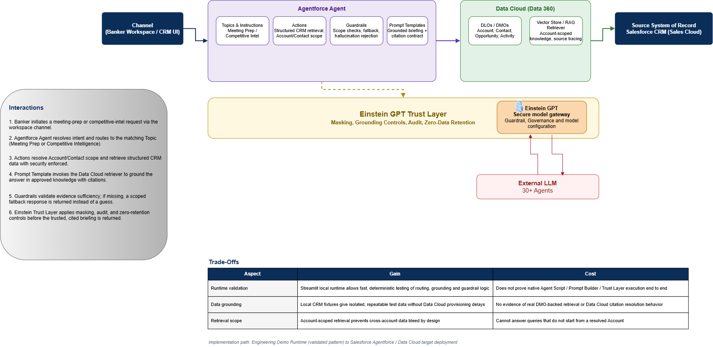
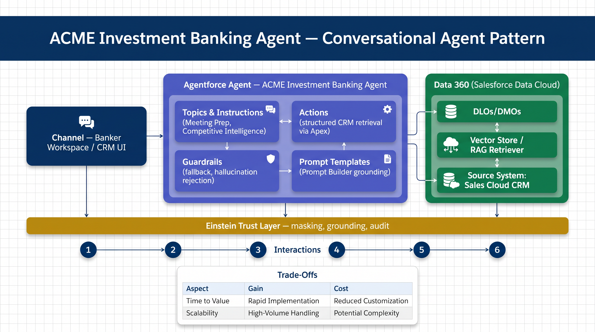

# Architecture Diagrams

This folder contains the presentation-ready architecture diagrams for the ACME Banking Intelligence Hub working build and its Salesforce target-state positioning.

The diagram set is intentionally layered:

- some diagrams describe the **current local working build**;
- some show the **target-state Salesforce alignment**;
- the functional diagram explains how **Meeting Prep operates step by step**;
- earlier iterations are preserved below for traceability of the engineering process.

## 1. Solution HLD

Shows the end-to-end proposed solution: banker interaction, Salesforce UX, Agentforce Supervisor/Planner, Meeting Prep Agent, CRM and Data Cloud business entities, DMO-backed retriever, Evidence Context, Prompt Builder, Einstein Trust Layer, and Enterprise Interoperability across 30+ specialized agents.

## 2. Functional Diagram — Option B (Meeting Prep)

Shows how the Meeting Prep capability operates functionally: banker request, account/contact scope resolution, parallel structured (CRM/Data Cloud DMOs) and unstructured (approved knowledge, semantic search) retrieval, Evidence Context assembly, grounded prompt execution via Prompt Builder, evidence and guardrail validation, and either a cited executive briefing or a safe fallback.

Use this diagram when explaining:
- how Meeting Prep actually runs;
- where scope is enforced;
- where structured and unstructured evidence converge;
- how fallback and observability fit the runtime behavior.

An interactive, executive-styled export of this same diagram is available at [2_acme-optionB-meeting-prep-diagram.html](2_acme-optionB-meeting-prep-diagram.html).

## 3. Solution Flow

Shows the executive path from the reviewer interaction through the UI, AI runtime, assurance controls, and evidence package.

## 4. Design Trade-offs (highlighted)

Consolidated view of the key architectural trade-offs (runtime choice, CRM fixtures vs. Data Cloud, custom retriever vs. native retriever, account-scoped retrieval, second-capability breadth) and their migration paths to native Agentforce/Data Cloud production.

See [design-trade-offs.md](design-trade-offs.md) for the full documented rationale behind each trade-off.

## Solution Architecture and Detailed Blueprint

Complementary artifacts and earlier iterations of the architecture, preserved as engineering record and supporting documentation for the diagrams above:

- [high-level-architecture.png](high-level-architecture.png) — earlier version of the HLD, prior to consolidation
- [Salesforce_Proposed_Architecture.png](Salesforce_Proposed_Architecture.png) — additional Salesforce-aligned reference diagram
- [detailed-architecture-salesforce-mapping.png](detailed-architecture-salesforce-mapping.png) — detailed local working build mapped to Salesforce/Agentforce target capabilities; present as an **architecture mapping view**, not a claim that every mapped component is already live in Salesforce
- [architecture-diagram.md](architecture-diagram.md) — current HLD in Mermaid (text-based, accessible format)
- [architecture-diagram11-08.md](architecture-diagram11-08.md) — earlier (Aug 11) Mermaid version of the HLD
- [solution-blueprint.md](solution-blueprint.md) — current full solution blueprint (problem statement through reusability pattern)
- [solution-blueprint11-08.md](solution-blueprint11-08.md) — earlier (Aug 11) version of the solution blueprint
- [option-b-architecture.md](option-b-architecture.md) — Option B target/reference architecture (not part of the live demo runtime)
- [platform-judgment-callout.md](platform-judgment-callout.md) — platform judgment: custom stack vs. native Agentforce/Data Cloud
- [platform-limitations.md](platform-limitations.md) — documented platform-level constraints (e.g., Data Cloud citation resolution)

## Visual conventions

| Color | Meaning |
| --- | --- |
| Light blue | User experience, supervisors, orchestration, and specialist agents |
| Green | Retrieval and trusted data sources |
| Purple | Grounding, prompt contracts, and guardrail validation |
| Sand / amber | Business outputs and executive artifacts |
| Gray-blue | Validation, observability, and target-state mapping |

## Presentation guidance

Use the diagrams in this order to fullfil the artifacts:

1. **Solution HLD** — establish the executive architecture narrative
2. **Functional Diagram — Option B** — explain runtime behavior in detail
3. **Solution Flow** — walk through the executive user journey end to end
4. **Design Trade-offs** — proactively address platform judgment and known constraints
5. **Solution Architecture and Detailed Blueprint** — reference for deeper technical follow-up questions

This sequence helps distinguish:
- what is implemented in the demo engineering runtime;
- what is validated as architecture and behavior;
- what is proposed as the Salesforce enterprise target runtime.
