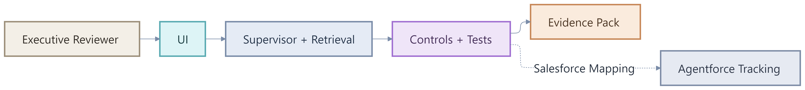
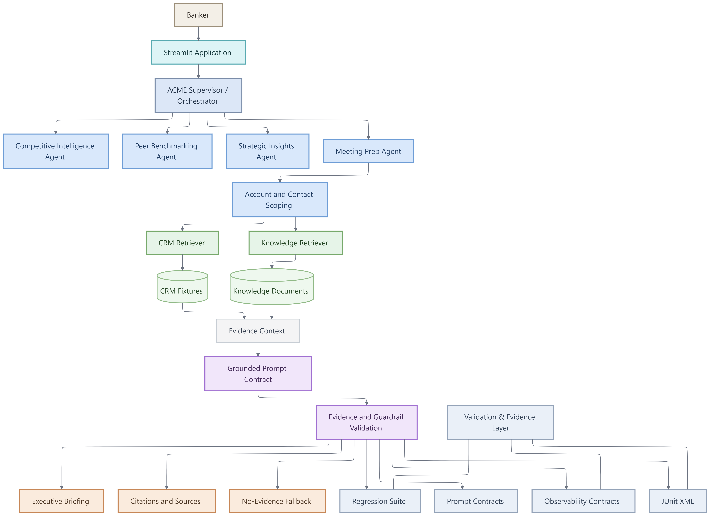
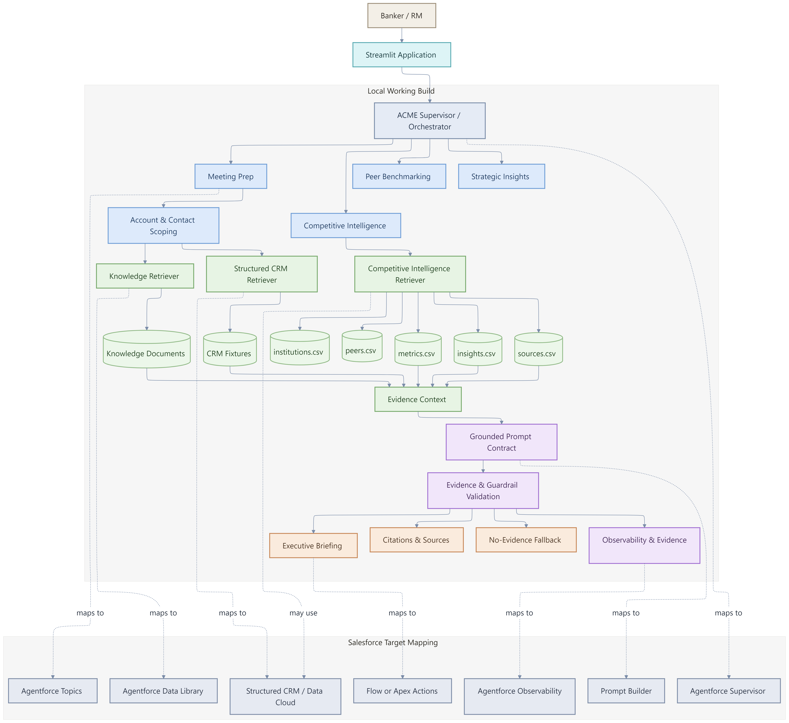

# Architecture Diagrams

This folder contains the presentation-ready architecture diagrams for the ACME Banking Intelligence Hub working build.

## 1. Solution Flow

Shows the executive path from the reviewer interaction through the UI, AI runtime, assurance controls and evidence package.

## 2. High-Level Architecture

Shows the end-to-end workflow: banker interaction, supervisor orchestration, specialized agents, CRM and knowledge retrieval, evidence grounding, guardrails, outputs and validation artifacts.

## 3. Detailed Architecture & Salesforce Target Mapping

Shows the detailed local working build and its target-state mapping to Salesforce and Agentforce capabilities.

## Visual conventions

| Color | Meaning |
|---|---|
| Light blue | User experience, supervisors and specialist agents |
| Green | Retrieval and trusted data sources |
| Purple | Grounding, prompt contracts and guardrail validation |
| Sand / amber | Business outputs and executive artifacts |
| Gray-blue | Validation, observability and Salesforce target mapping |