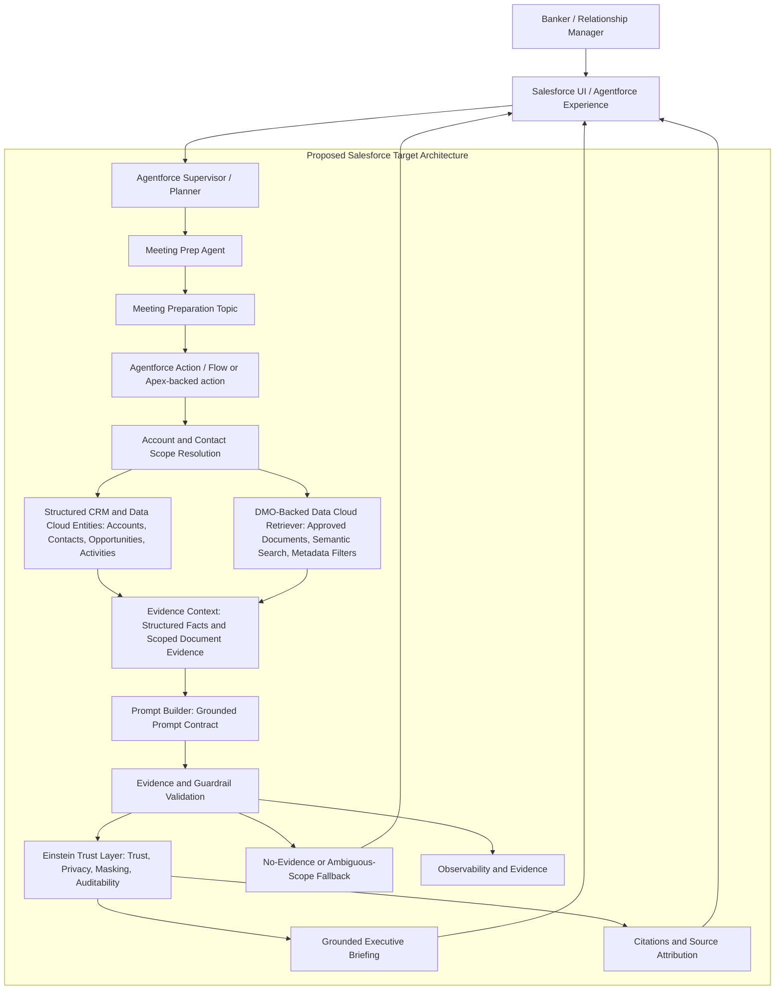

# High-Level Architecture: Investment Banking Meeting Prep

## Architecture Decision

The proposed final architecture is **DMO-backed hybrid retrieval**. Structured
CRM facts are retrieved through deterministic account and contact context.
Approved unstructured documents are retrieved through a DMO-backed Data Cloud
Retriever using semantic search and metadata filtering. Both flows converge in
an Evidence Context before Prompt Builder generates a grounded briefing.

Data Library is a valid faster-start alternative, but it is not the selected
primary target architecture for this metadata-rich Investment Banking use case.
