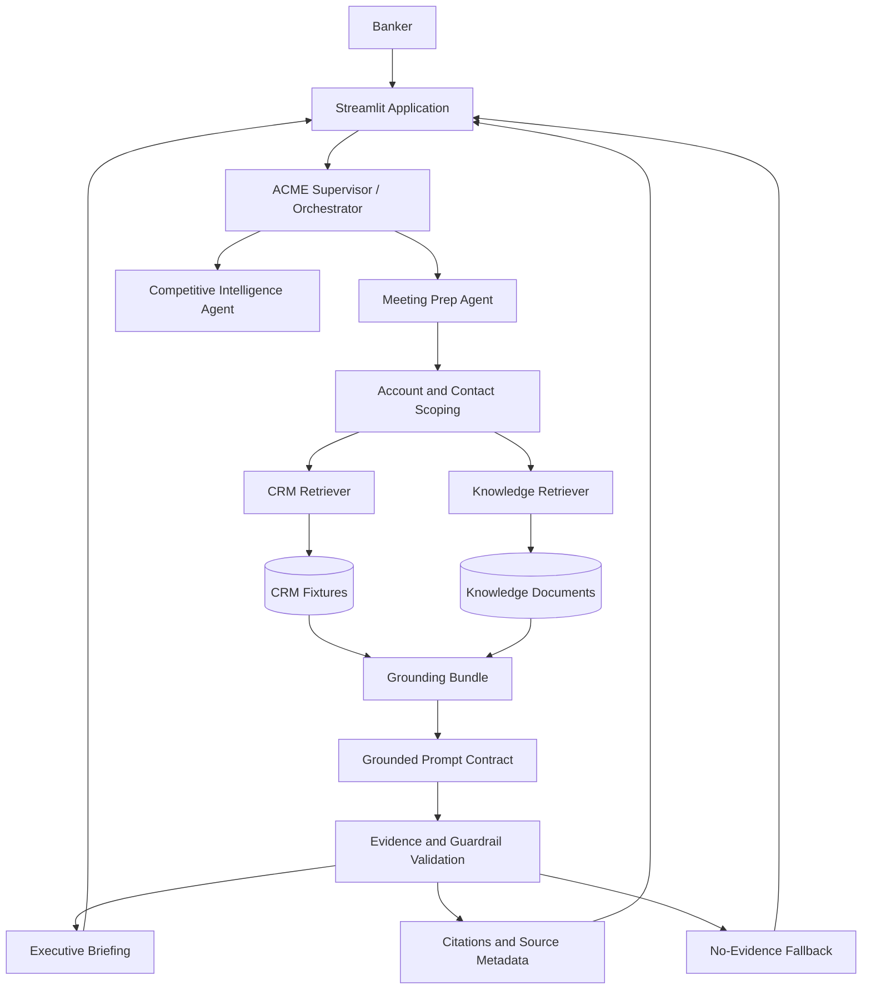

# Architecture Diagram

## Diagram

## Reading the diagram

- The banker starts in the Streamlit interface.
- The supervisor resolves intent and routes the request.
- The meeting prep agent narrows the request to a specific account and contact.
- Structured and unstructured retrieval feed a shared grounding bundle.
- The prompt contract generates the answer only after validation.
- The final response returns citations, source metadata, or fallback behavior when necessary.

## Notes

This diagram should stay simple and readable. It is better as a high-level reference than as a full runtime spec.