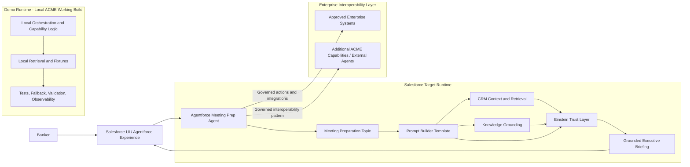

# Architecture Diagram: Meeting Prep Target Runtime

```mermaid
flowchart LR
    Banker[Banker] --> UX[Salesforce UI / Agentforce Experience]

    subgraph SF[Salesforce Target Runtime]
        Agent[Agentforce Meeting Prep Agent]
        Topic[Meeting Preparation Topic]
        Prompt[Prompt Builder Template]
        CRM[CRM Context and Retrieval]
        Know[Knowledge Grounding]
        Trust[Einstein Trust Layer]
        Brief[Grounded Executive Briefing]

        Agent --> Topic
        Topic --> Prompt
        Prompt --> CRM
        Prompt --> Know
        CRM --> Trust
        Know --> Trust
        Prompt --> Trust
        Trust --> Brief
    end

    UX --> Agent
    Brief --> UX

    subgraph Demo[Demo Runtime - Local ACME Working Build]
        LocalOrch[Local Orchestration and Capability Logic]
        LocalRet[Local Retrieval and Fixtures]
        LocalTests[Tests, Fallback, Validation, Observability]
    end

    LocalOrch --> LocalRet
    LocalRet --> LocalTests

    subgraph Enterprise[Enterprise Interoperability Layer]
        Systems[Approved Enterprise Systems]
        ExtCaps[Additional ACME Capabilities / External Agents]
    end

    Agent -->|Governed actions and integrations| Systems
    Agent -->|Governed interoperability pattern| ExtCaps
```