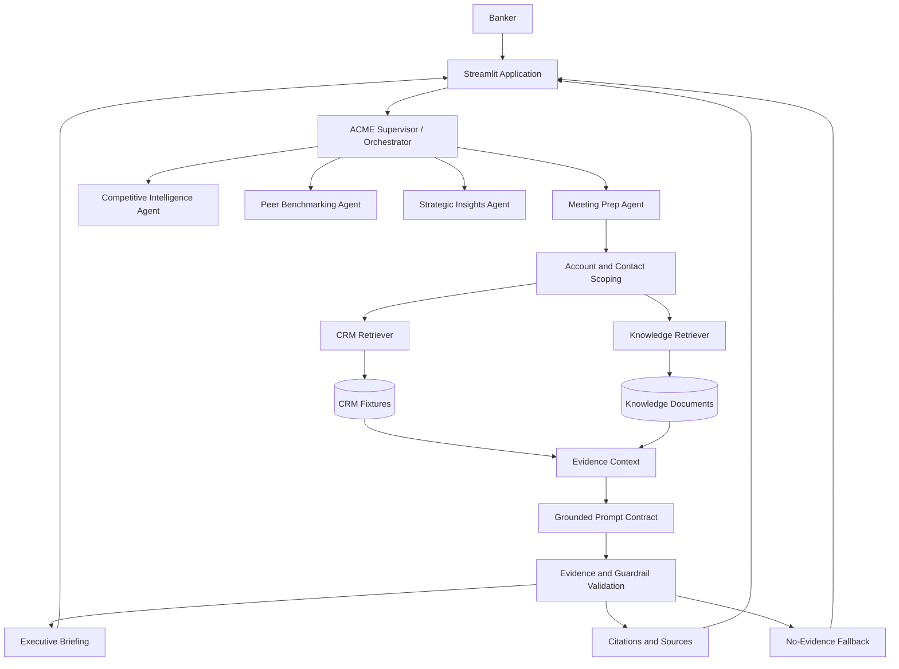

# Option B Architecture

## Purpose
This document describes the local Investment Bank ACME working build for Option B: Knowledge-Grounded Meeting Prep Agent, and maps it to the target Salesforce/Agentforce concepts.

## Detailed Solution Architecture

## Key Decisions
- Structured facts come from CRM fixtures.
- Unstructured context comes from knowledge fixtures.
- The response must stay scoped to the resolved account and contact.
- Missing evidence must trigger an explicit fallback.
- Citations must remain visible or recoverable from source metadata.

## Salesforce Target Mapping
- Supervisor/orchestrator -> Agentforce Supervisor
- Meeting Prep -> Agentforce topic / agent capability
- CRM Retriever -> structured CRM actions or Data Cloud-backed retrieval
- Knowledge Retriever -> Agentforce Data Library
- Grounded prompt -> Prompt Builder template
- Validation and fallback -> agent guardrails and operational checks