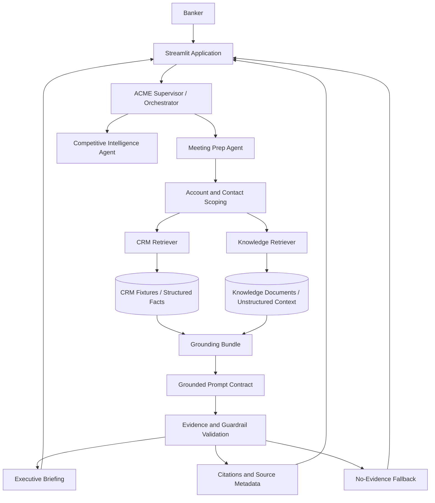

# Solution Blueprint

## Purpose

This document describes the final working blueprint for the ACME Investment Banking knowledge-grounded meeting prep solution. It expands the existing Option B architecture into the target-ready design for Front 2.

## Scope

The solution combines:
- a supervisor layer for routing and scope control;
- a meeting prep capability grounded in CRM and knowledge sources;
- a competitive intelligence capability that reuses the same grounding and policy patterns;
- a unified evidence bundle for citations, validation, and fallback handling;
- a documentation trail that distinguishes the demo runtime from the target enterprise runtime.

## Architecture Overview

## Core Design Principles

- Keep the response strictly scoped to the resolved account and contact.
- Ground every answer in retrievable CRM or knowledge evidence.
- Prefer visible citations, source metadata, and traceable facts over free-form generation.
- Fall back explicitly when evidence is missing rather than inventing coverage.
- Reuse the same pattern for future capabilities so the architecture can scale beyond a single use case.

## Retrieval and Grounding

The retrieval layer is split into two complementary paths:
- structured retrieval from CRM fixtures or CRM-backed services;
- unstructured retrieval from knowledge documents and supporting content.

Both paths feed a single grounding bundle that normalizes evidence into a format the prompt contract can consume. The bundle should carry source type, scope, snippet content, and a confidence or relevance signal.

## Prompt and Validation Contract

The prompt contract must:
- reflect the resolved account and contact;
- reference only evidence that is actually available;
- request citations or source tracing in the response;
- activate fallback behavior when the bundle is empty or incomplete.

Validation must check:
- scope correctness;
- evidence presence;
- citation visibility or recoverability;
- guardrail compliance;
- fallback activation when needed.

## Demo Runtime vs Target Runtime

The current Streamlit working build is the demo runtime. It is optimized for local validation, screenshots, and evidence collection.

The target runtime is the Salesforce/Agentforce implementation. It is optimized for:
- reusable agent topics;
- supervisor routing;
- Data Library or structured retrieval;
- Prompt Builder templates;
- trust controls and operational guardrails;
- enterprise observability.

The demo runtime should remain simple and deterministic while the target runtime is described with the enterprise platform mapping in the supporting docs.

## Salesforce Mapping

- Supervisor/orchestrator -> Agentforce Supervisor.
- Meeting Prep -> Agentforce topic or agent capability.
- CRM Retriever -> structured CRM actions or Data Cloud-backed retrieval.
- Knowledge Retriever -> Agentforce Data Library.
- Grounded Prompt -> Prompt Builder template.
- Validation and fallback -> agent guardrails and operational checks.
- Citations and source metadata -> trust and response verification layer.

## Front 2 Delivery Scope

Front 2 should deliver:
- a documented target architecture;
- a platform decision note;
- a demo-vs-target runtime comparison;
- the existing architecture diagram refined and referenced from this blueprint;
- the reusable policies, contracts, and retrieval design already introduced in the branch.

## Open Questions

- Which retrieval source is the primary target in the final enterprise version: Data Library, CRM-backed actions, or a hybrid design.
- Which parts of the current demo runtime should be preserved exactly as-is for the final evidence trail.
- Which agent patterns should be standardized first so future capabilities can reuse the same contracts.